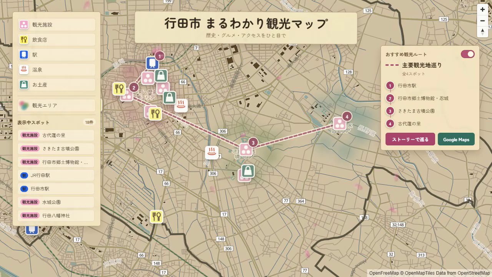

# 行田市まるわかり観光マップ

埼玉県行田市を対象に、地図・写真・動画・観光ルートを組み合わせ、観光地の位置関係と現地の雰囲気を一つの画面で伝えるWeb GISです。

- [公開Webマップ](https://furuhashilab.github.io/2026gsc_ShotaArakawa/)
- [2025年ゼミ論リポジトリ](https://github.com/furuhashilab/2025gsc_ShotaArakawa)




## 研究概要

Web地図は観光地の位置関係を把握しやすい一方、現地の雰囲気や体験を伝えることは得意ではありません。動画は雰囲気を伝えやすい一方、各地点の位置関係や周遊順序を把握しにくいという特徴があります。

本研究では、両者の長所を組み合わせ、行田市を初めて訪れる観光客が「どこに何があるか」「現地で何を体験できるか」「どの順番で巡るか」を短時間で理解できる観光Webマップを構築します。

また、2025年のゼミ論を進めていくうえで得られた、「観光マップを作製・閲覧することで自身の街への理解が進む」という学びから、利用者からの声を集めて反映し複数人で作り上げる「育てる観光マップ」を目指します。そのうえで、前年度までのテーマであった「動画」は主要観光地等に限って作成し、2025年の研究内容は引き継ぐものとします。
しかし、課題として、私自身が卒業した後の管理が考えられる。
## 体験設計

本Webマップでは、情報の役割を次のように分けています。

1. **地図**: 観光スポット同士の位置関係と観光エリアを把握する
2. **写真・短尺動画**: 現地の雰囲気や体験を理解する
3. **推薦ルート**: 観光地を巡る順序を知る
4. **Google Maps**: 現在地から目的地までの実際の移動へ接続する

## 現在の実装

- MapLibre GL JSによるベクトル地図表示
- 行田市境界のGeoJSON表示
- 観光施設、飲食店、駅、温泉、お土産のカテゴリ別マーカー
- カテゴリごとのオリジナルアイコン
- カテゴリ別の表示・非表示切り替え
- 表示中スポットの一覧表示
- ピンまたは一覧クリックによる詳細カード表示
- 写真、ショート動画、公式サイト、Vlogリンクの条件付き表示
- Geolocation APIとGoogle Mapsを利用した道案内
- 観光エリアを示す境界のない半透明グラデーション
- 行田市駅、忍城、さきたま古墳公園、古代蓮の里を巡る推薦ルート
- 斜め視点のカメラ移動によるルートストーリーモード
- スマートフォンでのカテゴリ一覧・ルートパネルの開閉
- 古地図・紙地図を意識した配色とUI

## 2025年ゼミ論からの発展

2025年ゼミ論では、地図上のポップアップに写真や動画を表示する動画連携型観光マップを制作しました。2026年度の卒業論文では、単独地点の情報提示から、観光空間全体の理解と周遊体験の設計へ研究対象を広げます。

主な変更点は次のとおりです。

- 地図上のポップアップを、デスクトップ左側・スマートフォン下部の詳細カードへ変更
- 単色ピンをカテゴリ別のオリジナルアイコンへ変更
- カテゴリの表示切り替えとスポット一覧を追加
- 観光地が集中するエリアをグラデーションで可視化
- 推薦観光ルートとストーリーモードを追加
- 古地図・紙地図を意識した地図スタイルへ変更
- スマートフォンで地図操作を妨げないパネル開閉を追加

## 技術構成

- HTML
- CSS
- JavaScript
- MapLibre GL JS
- OpenFreeMap / OpenStreetMap
- GeoJSON
- Google Maps URL連携
- GitHub Pages


## 評価計画

今後は、行田市を詳しく知らない利用者による操作テストを行い、次の点を確認します。

- 主要観光地の位置関係を把握できるか
- 写真・動画から現地の雰囲気を理解できるか
- 推薦ルートの順序を理解できるか
- 次に訪れたい場所を決められるか
- スマートフォン上で地図とパネルを無理なく操作できるか

操作結果、所要時間、発話・インタビュー内容を記録し、UIと情報提示方法の改善に利用します。

## 今後の予定

- スポット情報と動画コンテンツの追加・更新
- 滞在時間や交通手段に応じた複数ルートの検討
- 現地でのスマートフォン利用テスト
- 観光エリア表現とルートストーリーの改善
- 利用者からの声の集め方
- 評価結果の整理と卒業論文の執筆

## ローカルでの確認

`file://` ではGeoJSONや地図スタイルを正常に取得できないため、ローカルサーバーを使用します。

VS Codeの場合:

1. このリポジトリをVS Codeで開く
2. Live Server拡張機能を起動する
3. `index.html` を `Open with Live Server` で開く

## ファイル構成

```text
index.html                    現行版の画面構造
style.css                     現行版のレイアウトとデザイン
main.js                       地図、スポット、ルート、詳細カードの処理
gyoda-style.json              MapLibre用ベクトル地図スタイル
gyoda_geojson.geojson         行田市境界データ
tourism-areas.geojson         観光エリアとラベル
tourism-area-glow.geojson     観光エリアのグラデーション用ポイント
assets/                       現行版の画像素材
docs/images/                  README用画像
css/ data/ js/ legacy/        2025年ゼミ論版の実装資料
map/ resources/ styles/       2025年ゼミ論版の地図関連資料
```

2025年版のファイル群は、研究・実装の変化を追跡できるよう参考資料として残しています。公開ページではルート直下の現行版ファイルを使用します。

## ライセンス・データ出典

- 地図ライブラリ: MapLibre GL JS
- 地図データ: OpenStreetMap contributors
- ベクトル地図: OpenFreeMap / OpenMapTiles
- 既存のライセンス情報は [LICENSE.md](LICENSE.md) を参照してください
